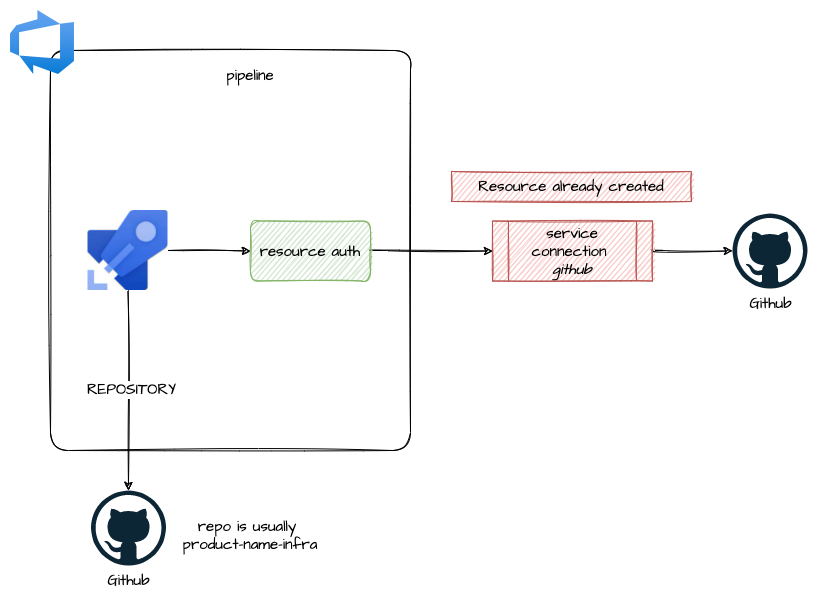

# azuredevops_build_definition_deploy

Module that allows the creation of a pipeline dedicated to code review of terraform code

* **pipeline**: creation with repo usually linked to `product-name-infra`
* **resource auth**: create authorization that allow to connect to (service connection already created):
  * github service connection

## Architecture



## How to use

```ts
variable "io-pn-mock" {
  default = {
    repository = {
      organization    = "pagopa"
      name            = "io-pn-mock"
      branch_name     = "refs/heads/master"
      pipelines_path  = ".devops"
      yml_prefix_name = null
    }
    pipeline = {
      enable_code_review = true
      enable_deploy      = false
    }
  }
}

locals {
  # global vars
  io-pn-mock-variables = {
    cache_version_id = "v1"
  }
  # global secrets
  io-pn-mock-variables_secret = {

  }
  # code_review vars
  io-pn-mock-variables_code_review = {

  }
  # code_review secrets
  io-pn-mock-variables_secret_code_review = {
    danger_github_api_token = module.secrets.values["DANGER-GITHUB-API-TOKEN"].value
  }
  # deploy vars
  io-pn-mock-variables_deploy = {

  }
  # deploy secret vars
  io-pn-mock-variables_secret_deploy = {

  }
}

#
# Code Review
#
module "io-pn-mock_code_review" {
  source = "git::https://github.com/pagopa/azuredevops-tf-modules.git//azuredevops_build_definition_code_review?ref=fix-pipelines-names"
  count  = var.io-pn-mock.pipeline.enable_code_review == true ? 1 : 0

  project_id                   = azuredevops_project.project.id
  repository                   = var.io-pn-mock.repository
  github_service_connection_id = azuredevops_serviceendpoint_github.io-azure-devops-github-pr.id
  path                         = var.io-pn-mock.repository.name

  pull_request_trigger_use_yaml = true

  variables = merge(
    local.io-pn-mock-variables,
    local.io-pn-mock-variables_code_review,
  )

  variables_secret = merge(
    local.io-pn-mock-variables_secret,
    local.io-pn-mock-variables_secret_code_review,
  )

  service_connection_ids_authorization = [
    azuredevops_serviceendpoint_github.io-azure-devops-github-ro.id,
  ]
}

```

<!-- markdownlint-disable -->
<!-- BEGIN_TF_DOCS -->
## Requirements

| Name | Version |
|------|---------|
| <a name="requirement_terraform"></a> [terraform](#requirement\_terraform) | >= 1.3.0 |
| <a name="requirement_azuredevops"></a> [azuredevops](#requirement\_azuredevops) | ~> 1.1 |
| <a name="requirement_azurerm"></a> [azurerm](#requirement\_azurerm) | ~> 3.107 |
| <a name="requirement_time"></a> [time](#requirement\_time) | ~> 0.11 |

## Modules

No modules.

## Resources

| Name | Type |
|------|------|
| [azuredevops_build_definition.pipeline](https://registry.terraform.io/providers/microsoft/azuredevops/latest/docs/resources/build_definition) | resource |
| [azuredevops_pipeline_authorization.github_service_connection_authorization](https://registry.terraform.io/providers/microsoft/azuredevops/latest/docs/resources/pipeline_authorization) | resource |
| [azuredevops_pipeline_authorization.service_connection_ids_authorization](https://registry.terraform.io/providers/microsoft/azuredevops/latest/docs/resources/pipeline_authorization) | resource |
| [time_sleep.wait](https://registry.terraform.io/providers/hashicorp/time/latest/docs/resources/sleep) | resource |

## Inputs

| Name | Description | Type | Default | Required |
|------|-------------|------|---------|:--------:|
| <a name="input_agent_pool_name"></a> [agent\_pool\_name](#input\_agent\_pool\_name) | The agent pool that should execute the build | `string` | `"Azure Pipelines"` | no |
| <a name="input_ci_trigger_enabled"></a> [ci\_trigger\_enabled](#input\_ci\_trigger\_enabled) | Enabled or disabled Continuous Integration | `bool` | `false` | no |
| <a name="input_ci_trigger_use_yaml"></a> [ci\_trigger\_use\_yaml](#input\_ci\_trigger\_use\_yaml) | (Optional) Use the azure-pipeline file for the build configuration. Defaults to false. | `bool` | `false` | no |
| <a name="input_github_service_connection_id"></a> [github\_service\_connection\_id](#input\_github\_service\_connection\_id) | (Required) GitHub service connection ID used to link Azure DevOps. | `string` | n/a | yes |
| <a name="input_path"></a> [path](#input\_path) | (Required) Pipeline path on Azure DevOps | `string` | n/a | yes |
| <a name="input_pipeline_name_prefix"></a> [pipeline\_name\_prefix](#input\_pipeline\_name\_prefix) | (Optional) Pipeline name prefix to join to the .code-review suffix | `string` | `null` | no |
| <a name="input_project_id"></a> [project\_id](#input\_project\_id) | (Required) Azure DevOps project ID | `string` | n/a | yes |
| <a name="input_pull_request_trigger_auto_cancel"></a> [pull\_request\_trigger\_auto\_cancel](#input\_pull\_request\_trigger\_auto\_cancel) | Allow to cancel previous runs | `bool` | `true` | no |
| <a name="input_pull_request_trigger_enabled"></a> [pull\_request\_trigger\_enabled](#input\_pull\_request\_trigger\_enabled) | Enabled or disabled pull request validation trigger | `bool` | `true` | no |
| <a name="input_pull_request_trigger_use_yaml"></a> [pull\_request\_trigger\_use\_yaml](#input\_pull\_request\_trigger\_use\_yaml) | (Optional) Use the azure-pipeline file for the build configuration. Defaults to false. | `bool` | `true` | no |
| <a name="input_repository"></a> [repository](#input\_repository) | (Required) GitHub repository attributes | <pre>object({<br/>    organization    = string # organization name (e.g. pagopaspa)<br/>    name            = string # repository name inside the organizzation<br/>    branch_name     = string<br/>    pipelines_path  = string # path where i can find the pipelines yaml<br/>    yml_prefix_name = string # prefix for yaml pipeline<br/>  })</pre> | n/a | yes |
| <a name="input_repository_repo_type"></a> [repository\_repo\_type](#input\_repository\_repo\_type) | (Optional) The repository type. Valid values: GitHub or GitHub Enterprise. Defaults to GitHub. If repo\_type is GitHubEnterprise, must use existing project and GitHub Enterprise service connection. | `string` | `"GitHub"` | no |
| <a name="input_service_connection_ids_authorization"></a> [service\_connection\_ids\_authorization](#input\_service\_connection\_ids\_authorization) | (Optional) List service connection IDs that pipeline needs authorization. github\_service\_connection\_id is authorized by default | `list(string)` | `null` | no |
| <a name="input_variables"></a> [variables](#input\_variables) | (Optional) Pipeline variables | `map(any)` | `null` | no |
| <a name="input_variables_secret"></a> [variables\_secret](#input\_variables\_secret) | (Optional) Pipeline secret variables | `map(any)` | `null` | no |

## Outputs

No outputs.
<!-- END_TF_DOCS -->
