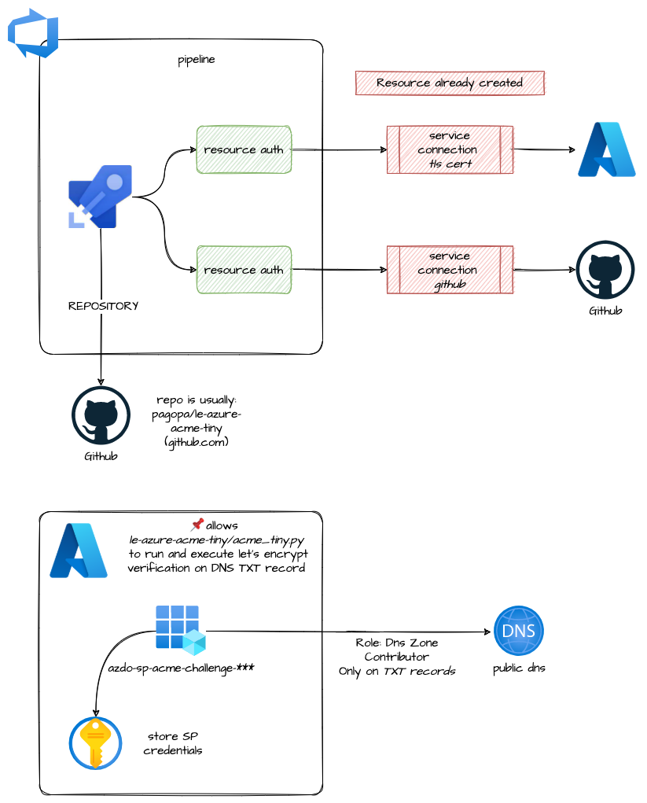

# azuredevops_build_definition_tls_cert

Module that allows:

* **pipeline**: creation with repo usually linked to <https://github.com/pagopa/le-azure-acme-tiny>
* **resource auth**: create authorization that allow to connect to (service connection already created):
  * github service connection
  * azure rm service connection (usually: `XXX-TLS-CERT-SERVICE-CONN`)
* **SP azdo-sp-acme-challenge-xxx**: that allow the python script acme_tiny.py to create a DNS record TXT on DNS to valite certificate on Let's encrypt

## Architecture

<!-- markdownlint-disable -->
<!-- BEGINNING OF PRE-COMMIT-TERRAFORM DOCS HOOK -->
## Requirements

| Name | Version |
|------|---------|
|  [terraform](#requirement\_terraform) | >= 0.14.5 |
|  [azuredevops](#requirement\_azuredevops) | >= 0.1.8 |
|  [azurerm](#requirement\_azurerm) | >= 2.60.0, <= 2.99.0 |
|  [null](#requirement\_null) | >= 3.1.0 |
|  [time](#requirement\_time) | >= 0.7.0 |

## Modules

| Name | Source | Version |
|------|--------|---------|
|  [secrets](#module\_secrets) | git::https://github.com/pagopa/azurerm.git//key_vault_secrets_query | v1.0.11 |

## Resources

| Name | Type |
|------|------|
| [azuredevops_build_definition.pipeline](https://registry.terraform.io/providers/microsoft/azuredevops/latest/docs/resources/build_definition) | resource |
| [azuredevops_resource_authorization.github_service_connection_authorization](https://registry.terraform.io/providers/microsoft/azuredevops/latest/docs/resources/resource_authorization) | resource |
| [azuredevops_resource_authorization.service_connection_ids_authorization](https://registry.terraform.io/providers/microsoft/azuredevops/latest/docs/resources/resource_authorization) | resource |
| [null_resource.this](https://registry.terraform.io/providers/hashicorp/null/latest/docs/resources/resource) | resource |
| [time_sleep.wait](https://registry.terraform.io/providers/hashicorp/time/latest/docs/resources/sleep) | resource |

## Inputs

| Name | Description | Type | Default | Required |
|------|-------------|------|---------|:--------:|
|  [agent\_pool\_name](#input\_agent\_pool\_name) | The agent pool that should execute the build | `string` | `"Hosted Ubuntu 1604"` | no |
|  [credential\_key\_vault\_name](#input\_credential\_key\_vault\_name) | (Required) key vault where store service principal credentials | `string` | n/a | yes |
|  [credential\_key\_vault\_resource\_group](#input\_credential\_key\_vault\_resource\_group) | (Required) key vault resource group where store service principal credentials | `string` | n/a | yes |
|  [credential\_subcription](#input\_credential\_subcription) | (Required) Azure Subscription where store service principal credentials | `string` | n/a | yes |
|  [dns\_record\_name](#input\_dns\_record\_name) | (Required) Dns record name | `string` | n/a | yes |
|  [dns\_zone\_name](#input\_dns\_zone\_name) | (Required) Dns zone name | `string` | n/a | yes |
|  [dns\_zone\_resource\_group](#input\_dns\_zone\_resource\_group) | (Required) Dns zone resource group name | `string` | n/a | yes |
|  [github\_service\_connection\_id](#input\_github\_service\_connection\_id) | (Required) GitHub service connection ID used to link Azure DevOps. | `string` | n/a | yes |
|  [name](#input\_name) | (Required) Pipeline name equals to domain name | `string` | n/a | yes |
|  [path](#input\_path) | (Required) Pipeline path on Azure DevOps | `string` | n/a | yes |
|  [project\_id](#input\_project\_id) | (Required) Azure DevOps project ID | `string` | n/a | yes |
|  [renew\_token](#input\_renew\_token) | (Required) Renew token to recreate service principal. Change it to renew service principal credentials | `string` | n/a | yes |
|  [repository](#input\_repository) | (Required) GitHub repository attributes | <pre>object({     organization   = string     name           = string     branch_name    = string     pipelines_path = string   })</pre> | n/a | yes |
|  [schedules](#input\_schedules) | Allow to setup schedules trigger in azure devops. Usign that the schedules used in the yaml will be disabled | <pre>object({     days_to_build              = list(string)     schedule_only_with_changes = bool     start_hours                = number     start_minutes              = number     time_zone                  = string     branch_filter = object({       include = list(string)       exclude = list(string)     })   })</pre> | <pre>{   "branch_filter": {     "exclude": [],     "include": [       "main",       "master"     ]   },   "days_to_build": [     "Mon"   ],   "schedule_only_with_changes": false,   "start_hours": 1,   "start_minutes": 0,   "time_zone": "(UTC+01:00) Amsterdam, Berlin, Bern, Rome, Stockholm, Vienna" }</pre> | no |
|  [service\_connection\_ids\_authorization](#input\_service\_connection\_ids\_authorization) | (Optional) List service connection IDs that pipeline needs authorization. github\_service\_connection\_id is authorized by default | `list(string)` | `null` | no |
|  [subscription\_id](#input\_subscription\_id) | (Required) Azure Subscription ID related to tenant where create service principal | `string` | n/a | yes |
|  [subscription\_name](#input\_subscription\_name) | (Required) Azure Subscription name related to tenant where create service principal | `string` | n/a | yes |
|  [tenant\_id](#input\_tenant\_id) | (Required) Azure Tenant ID related to tenant where create service principal | `string` | n/a | yes |
|  [variables](#input\_variables) | (Optional) Pipeline variables | `map(any)` | `null` | no |
|  [variables\_secret](#input\_variables\_secret) | (Optional) Pipeline secret variables | `map(any)` | `null` | no |

## Outputs

No outputs.
<!-- END OF PRE-COMMIT-TERRAFORM DOCS HOOK -->
