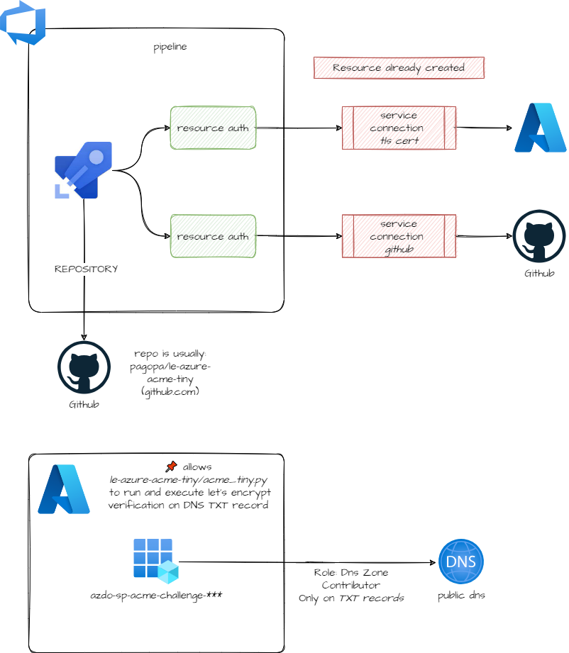

# azuredevops_build_definition_tls_cert_federated

Module for creating a AzureDevops pipeline that renews a TLS
certificate stored in Azure KeyVault with ACME on Let's Encrypt
authority.

This module manages the following resources:

* **Azure DevOps pipeline**: creation with repo usually linked to
  <https://github.com/pagopa/le-azure-acme-tiny>.
* **Azure Managed Identity with federated OIDC credentials** with
  permissions to modify a specific record in a DNS zone.  This
  identity is used for solving the ACME challenge, that consists in
  writing a TXT record on a DNS record.  The ACME challenge is solved
  bt the
  [acme_tiny.py](https://github.com/pagopa/le-azure-acme-tiny/blob/master/acme_tiny.py)
  script.
* **Azure RM service connection** for federated auth with the managed
  identity above (usually: `XXX-TLS-CERT-SERVICE-CONN`)

## Architecture



## Usage

Reference Azure DevOps project:
```hcl
data "azuredevops_project" "project" {
  name = "my-projects"
}
```

Get the GitHub token from KV:
```hcl
module "secret_core" {
  source = "git::https://github.com/pagopa/terraform-azurerm-v3//key_vault_secrets_query?ref=v7.20.0"
  resource_group = "my-kv-rg"
  key_vault_name = "my-kv"

  secrets = [
    "azure-devops-github-ro-TOKEN",
  ]
}
```

Create a AZDO service connection for cloning pipeline repo (i.e., `le-azure-acme-tiny`)
from GitHub with previously retrieved token:
```hcl
resource "azuredevops_serviceendpoint_github" "azure_devops_github_ro" {
  project_id            = data.azuredevops_project.project.id
  service_endpoint_name = "azure-devops-github-ro"
  auth_personal {
    personal_access_token = module.secret_core.values["azure-devops-github-ro-TOKEN"].value
  }
  lifecycle {
    ignore_changes = [description, authorization]
  }
}
```

Get Let's Encrypt credentials and store them into KV (requires Docker, it runs a local provisioner):
```hcl
module "letsencrypt" {
  source = "git::https://github.com/pagopa/terraform-azurerm-v3//letsencrypt_credential?ref=v7.20.0"

  prefix            = "my"
  env               = "p"
  key_vault_name    = "my-kv"
  subscription_name = "my-sub"
}
```

Create service connection and related managed identity for editing the certificate on KV:
```hcl
module "tls_cert_service_conn" {
  source = "git::https://github.com/pagopa/azuredevops-tf-modules.git//azuredevops_serviceendpoint_federated?ref=v4.0.0"

  project_id          = data.azuredevops_project.project.id
  name                = "my-p-tls-cert"
  tenant_id           = "my-tenant-id"
  subscription_name   = "my-sub-name"
  subscription_id     = "my-sub-id"
  location            = "westeurope"
  resource_group_name = "default-roleassignment-rg"
}

data "azurerm_key_vault" "kv" {
  resource_group_name = "my-kv-rg"
  name                = "my-kv"
}

resource "azurerm_key_vault_access_policy" "tls_cert_service_conn_kv_access_policy" {
  key_vault_id = data.azurerm_key_vault.kv.id
  tenant_id    = "my-tenant-id"
  object_id    = module.tls_cert_service_conn.identity_principal_id
  certificate_permissions = ["Get", "Import"]
}
```

Finally, use this module for creating pipeline:
```hcl
module "tlscert-portalefatturazione-pagopa-it-cert_az" {
  depends_on = [module.letsencrypt]

  source = "git::<https://github.com/pagopa/azuredevops-tf-modules.git//azuredevops_build_definition_tls_cert_federated?ref=v4.1.5>"

  project_id = data.azuredevops_project.project.id
  location   = "westeurope"
  repository = {
    organization   = "pagopa"
    name           = "le-azure-acme-tiny"
    branch_name    = "refs/heads/master"
    pipelines_path = "."
  }
  name                         = "my.pagopa.it"
  path                         = "my\\TLS-Certificates"
  github_service_connection_id = azuredevops_serviceendpoint_github.azure_devops_github_ro.id

  dns_record_name         = ""
  dns_zone_name           = "my.pagopa.it"
  dns_zone_resource_group = "my-dns-rg"
  tenant_id               = "my-tenant-id"
  subscription_name       = "my-sub"
  subscription_id         = "my-sub-id"

  credential_key_vault_name           = "my-kv"
  credential_key_vault_resource_group = "my-kv-rg"

  variables = {
    CERT_NAME_EXPIRE_SECONDS     = "2592000" #30 days
    KEY_VAULT_SERVICE_CONNECTION = module.tls_cert_service_conn.service_endpoint_name,
    KEY_VAULT_NAME               = "my-kv"
  }
  variables_secret = {}

  service_connection_ids_authorization = [ module.tls_cert_service_conn.service_endpoint_id ]

  schedules = {
    days_to_build              = ["Thu"]
    schedule_only_with_changes = false
    start_hours                = 3
    start_minutes              = 0
    time_zone                  = "(UTC+01:00) Amsterdam, Berlin, Bern, Rome, Stockholm, Vienna"
    branch_filter = {
      include = ["refs/heads/master"]
      exclude = []
    }
  }
}
```


<!-- markdownlint-disable -->
<!-- BEGINNING OF PRE-COMMIT-TERRAFORM DOCS HOOK -->
## Requirements

| Name | Version |
|------|---------|
| <a name="requirement_terraform"></a> [terraform](#requirement\_terraform) | >= 1.3.0 |
| <a name="requirement_azuredevops"></a> [azuredevops](#requirement\_azuredevops) | >= 0.10.0, <= 0.12.0 |
| <a name="requirement_azurerm"></a> [azurerm](#requirement\_azurerm) | <= 3.90.0 |
| <a name="requirement_time"></a> [time](#requirement\_time) | >= 0.7.0 |

## Modules

| Name | Source | Version |
|------|--------|---------|
| <a name="module_azuredevops_serviceendpoint_federated"></a> [azuredevops\_serviceendpoint\_federated](#module\_azuredevops\_serviceendpoint\_federated) | git::https://github.com/pagopa/azuredevops-tf-modules.git//azuredevops_serviceendpoint_federated | v5.4.0 |
| <a name="module_secrets"></a> [secrets](#module\_secrets) | git::https://github.com/pagopa/terraform-azurerm-v3.git//key_vault_secrets_query | v7.48.0 |

## Resources

| Name | Type |
|------|------|
| [azuredevops_build_definition.pipeline](https://registry.terraform.io/providers/microsoft/azuredevops/latest/docs/resources/build_definition) | resource |
| [azuredevops_pipeline_authorization.github_service_connection_authorization](https://registry.terraform.io/providers/microsoft/azuredevops/latest/docs/resources/pipeline_authorization) | resource |
| [azuredevops_pipeline_authorization.service_connection_ids_authorization](https://registry.terraform.io/providers/microsoft/azuredevops/latest/docs/resources/pipeline_authorization) | resource |
| [azuredevops_pipeline_authorization.service_connection_le_authorization](https://registry.terraform.io/providers/microsoft/azuredevops/latest/docs/resources/pipeline_authorization) | resource |
| [azurerm_role_assignment.managed_identity_default_role_assignment](https://registry.terraform.io/providers/hashicorp/azurerm/latest/docs/resources/role_assignment) | resource |
| [time_sleep.wait](https://registry.terraform.io/providers/hashicorp/time/latest/docs/resources/sleep) | resource |

## Inputs

| Name | Description | Type | Default | Required |
|------|-------------|------|---------|:--------:|
| <a name="input_agent_pool_name"></a> [agent\_pool\_name](#input\_agent\_pool\_name) | The agent pool that should execute the build | `string` | `"Azure Pipelines"` | no |
| <a name="input_credential_key_vault_name"></a> [credential\_key\_vault\_name](#input\_credential\_key\_vault\_name) | (Required) key vault where store service principal credentials | `string` | n/a | yes |
| <a name="input_credential_key_vault_resource_group"></a> [credential\_key\_vault\_resource\_group](#input\_credential\_key\_vault\_resource\_group) | (Required) key vault resource group where store service principal credentials | `string` | n/a | yes |
| <a name="input_dns_record_name"></a> [dns\_record\_name](#input\_dns\_record\_name) | (Required) Dns record name | `string` | n/a | yes |
| <a name="input_dns_zone_name"></a> [dns\_zone\_name](#input\_dns\_zone\_name) | (Required) Dns zone name | `string` | n/a | yes |
| <a name="input_dns_zone_resource_group"></a> [dns\_zone\_resource\_group](#input\_dns\_zone\_resource\_group) | (Required) Dns zone resource group name | `string` | n/a | yes |
| <a name="input_github_service_connection_id"></a> [github\_service\_connection\_id](#input\_github\_service\_connection\_id) | (Required) GitHub service connection ID used to link Azure DevOps. | `string` | n/a | yes |
| <a name="input_location"></a> [location](#input\_location) | n/a | `string` | n/a | yes |
| <a name="input_managed_identity_resource_group_name"></a> [managed\_identity\_resource\_group\_name](#input\_managed\_identity\_resource\_group\_name) | (Required) Managed identity resource group, where will be created | `string` | n/a | yes |
| <a name="input_path"></a> [path](#input\_path) | (Required) Pipeline path on Azure DevOps | `string` | n/a | yes |
| <a name="input_project_id"></a> [project\_id](#input\_project\_id) | (Required) Azure DevOps project ID | `string` | n/a | yes |
| <a name="input_repository"></a> [repository](#input\_repository) | (Required) GitHub repository attributes | <pre>object({<br>    organization   = string<br>    name           = string<br>    branch_name    = string<br>    pipelines_path = string<br>  })</pre> | n/a | yes |
| <a name="input_repository_repo_type"></a> [repository\_repo\_type](#input\_repository\_repo\_type) | (Optional) The repository type. Valid values: GitHub or GitHub Enterprise. Defaults to GitHub. If repo\_type is GitHubEnterprise, must use existing project and GitHub Enterprise service connection. | `string` | `"GitHub"` | no |
| <a name="input_schedules"></a> [schedules](#input\_schedules) | Allow to setup schedules trigger in azure devops. Usign that the schedules used in the yaml will be disabled | <pre>object({<br>    days_to_build              = list(string)<br>    schedule_only_with_changes = bool<br>    start_hours                = number<br>    start_minutes              = number<br>    time_zone                  = string<br>    branch_filter = object({<br>      include = list(string)<br>      exclude = list(string)<br>    })<br>  })</pre> | <pre>{<br>  "branch_filter": {<br>    "exclude": [],<br>    "include": [<br>      "main",<br>      "master"<br>    ]<br>  },<br>  "days_to_build": [<br>    "Fri"<br>  ],<br>  "schedule_only_with_changes": false,<br>  "start_hours": 1,<br>  "start_minutes": 0,<br>  "time_zone": "(UTC+01:00) Amsterdam, Berlin, Bern, Rome, Stockholm, Vienna"<br>}</pre> | no |
| <a name="input_service_connection_ids_authorization"></a> [service\_connection\_ids\_authorization](#input\_service\_connection\_ids\_authorization) | (Optional) List service connection IDs that pipeline needs authorization. github\_service\_connection\_id is authorized by default | `list(string)` | `null` | no |
| <a name="input_subscription_id"></a> [subscription\_id](#input\_subscription\_id) | (Required) Azure Subscription ID related to tenant where create service principal | `string` | n/a | yes |
| <a name="input_subscription_name"></a> [subscription\_name](#input\_subscription\_name) | (Required) Azure Subscription name related to tenant where create service principal | `string` | n/a | yes |
| <a name="input_tenant_id"></a> [tenant\_id](#input\_tenant\_id) | (Required) Azure Tenant ID related to tenant where create service principal | `string` | n/a | yes |
| <a name="input_variables"></a> [variables](#input\_variables) | (Optional) Pipeline variables | `map(any)` | `null` | no |
| <a name="input_variables_secret"></a> [variables\_secret](#input\_variables\_secret) | (Optional) Pipeline secret variables | `map(any)` | `null` | no |

## Outputs

No outputs.
<!-- END OF PRE-COMMIT-TERRAFORM DOCS HOOK -->
