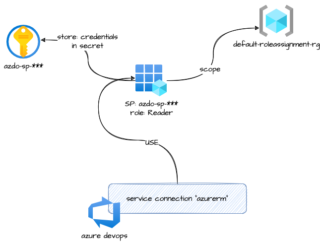

# azuredevops_serviceendpoint_azurerm_limited

This module allow the creation of a service connection (azurerm type) with name: `azdo-sp-plan-****`.
Using a Service Principal, and store the credentials into a Key Vault.

This Service principal is in charge to execute plans without require an approvation.

* `password_time_rotation_days`: The default credentials inside the app are created with 2 years of validation, this variable allow to renew before the expiration day

> 🏁 This connection can be used to manage from azure devops, azure resources inside subscription

## Architecture



## How to use it

```json
module "DEV-CSTAR-PLAN-SERVICE-CONN" {

  providers = {
    azurerm = azurerm.dev
  }

  depends_on = [data.azuredevops_project.project]
  source     = "git::https://github.com/pagopa/azuredevops-tf-modules.git//azuredevops_serviceendpoint_azurerm_plan?ref=add-service-endpoint-sp-personal"

  name_suffix                 = "${local.project_prefix_short}-dev"
  iac_aad_group_name          = "azure-devops-iac-service-connection"
  password_time_rotation_days = 365
  #renew_token                 = "v2" <- optional


  project_id      = data.azuredevops_project.project.id
  tenant_id       = module.secret_azdo.values["PAGOPAIT-TENANTID"].value
  subscription_id = module.secret_azdo.values["PAGOPAIT-DEV-CSTAR-SUBSCRIPTION-ID"].value

  credential_key_vault_name           = local.dev_idpay_key_vault_name
  credential_key_vault_resource_group = local.dev_idpay_key_vault_resource_group
}
```

> Use **renew_token** to force module to recreate the resource, for example change the value to "v2"

<!-- markdownlint-disable -->
<!-- BEGINNING OF PRE-COMMIT-TERRAFORM DOCS HOOK -->
## Requirements

| Name | Version |
|------|---------|
| <a name="requirement_terraform"></a> [terraform](#requirement\_terraform) | >= 1.3.0 |
| <a name="requirement_azuread"></a> [azuread](#requirement\_azuread) | >= 2.10.0 |
| <a name="requirement_azuredevops"></a> [azuredevops](#requirement\_azuredevops) | >= 0.10.0, <= 0.12.0 |
| <a name="requirement_azurerm"></a> [azurerm](#requirement\_azurerm) | <= 3.71.0 |
| <a name="requirement_null"></a> [null](#requirement\_null) | >= 1.3.0 |
| <a name="requirement_time"></a> [time](#requirement\_time) | >= 0.7.0 |

## Modules

| Name | Source | Version |
|------|--------|---------|
| <a name="module_secrets"></a> [secrets](#module\_secrets) | git::https://github.com/pagopa/terraform-azurerm-v3.git//key_vault_secrets_query | v7.48.0 |

## Resources

| Name | Type |
|------|------|
| [azuread_application.plan_app](https://registry.terraform.io/providers/hashicorp/azuread/latest/docs/resources/application) | resource |
| [azuread_application_password.plan_app](https://registry.terraform.io/providers/hashicorp/azuread/latest/docs/resources/application_password) | resource |
| [azuread_group_member.add_plan_app_to_directory_readers_group](https://registry.terraform.io/providers/hashicorp/azuread/latest/docs/resources/group_member) | resource |
| [azuread_service_principal.sp_plan](https://registry.terraform.io/providers/hashicorp/azuread/latest/docs/resources/service_principal) | resource |
| [azuredevops_serviceendpoint_azurerm.this](https://registry.terraform.io/providers/microsoft/azuredevops/latest/docs/resources/serviceendpoint_azurerm) | resource |
| [azurerm_key_vault_secret.credentials_password_value](https://registry.terraform.io/providers/hashicorp/azurerm/latest/docs/resources/key_vault_secret) | resource |
| [azurerm_role_assignment.default_resource_group_reader](https://registry.terraform.io/providers/hashicorp/azurerm/latest/docs/resources/role_assignment) | resource |
| [azurerm_role_assignment.plan_app_subscription](https://registry.terraform.io/providers/hashicorp/azurerm/latest/docs/resources/role_assignment) | resource |
| [time_rotating.credential_password_days](https://registry.terraform.io/providers/hashicorp/time/latest/docs/resources/rotating) | resource |
| [azuread_group.group_directory_reader_permissions](https://registry.terraform.io/providers/hashicorp/azuread/latest/docs/data-sources/group) | data source |
| [azurerm_key_vault.kv](https://registry.terraform.io/providers/hashicorp/azurerm/latest/docs/data-sources/key_vault) | data source |
| [azurerm_resource_group.this](https://registry.terraform.io/providers/hashicorp/azurerm/latest/docs/data-sources/resource_group) | data source |
| [azurerm_subscription.this](https://registry.terraform.io/providers/hashicorp/azurerm/latest/docs/data-sources/subscription) | data source |

## Inputs

| Name | Description | Type | Default | Required |
|------|-------------|------|---------|:--------:|
| <a name="input_credential_key_vault_name"></a> [credential\_key\_vault\_name](#input\_credential\_key\_vault\_name) | (Required) Key vault name where store service principal credentials | `string` | n/a | yes |
| <a name="input_credential_key_vault_resource_group"></a> [credential\_key\_vault\_resource\_group](#input\_credential\_key\_vault\_resource\_group) | (Required) Key vault resource group where store service principal credentials | `string` | n/a | yes |
| <a name="input_default_resource_group_name"></a> [default\_resource\_group\_name](#input\_default\_resource\_group\_name) | The name of the default resource group to link with the new app to allow the connection | `string` | `"default-roleassignment-rg"` | no |
| <a name="input_default_roleassignment_rg_prefix"></a> [default\_roleassignment\_rg\_prefix](#input\_default\_roleassignment\_rg\_prefix) | (Optional) Add a prefix to default\_roleassignment\_rg | `string` | `""` | no |
| <a name="input_iac_aad_group_name"></a> [iac\_aad\_group\_name](#input\_iac\_aad\_group\_name) | Azure AD group name for iac sp apps (with Directory Reader permissions at leats) | `string` | n/a | yes |
| <a name="input_name_suffix"></a> [name\_suffix](#input\_name\_suffix) | (Required) Service principal name suffix | `string` | n/a | yes |
| <a name="input_password_time_rotation_days"></a> [password\_time\_rotation\_days](#input\_password\_time\_rotation\_days) | How many days before the password(credentials) is rotated | `number` | `365` | no |
| <a name="input_project_id"></a> [project\_id](#input\_project\_id) | (Required) Azure DevOps project ID | `string` | n/a | yes |
| <a name="input_renew_token"></a> [renew\_token](#input\_renew\_token) | (Optional) Renew token to recreate service principal. Change it to renew service principal credentials | `string` | `"v1"` | no |
| <a name="input_subscription_id"></a> [subscription\_id](#input\_subscription\_id) | (Required) Azure Subscription ID related to tenant where create service principal | `string` | n/a | yes |
| <a name="input_tenant_id"></a> [tenant\_id](#input\_tenant\_id) | (Required) Azure Tenant ID related to tenant where create service principal | `string` | n/a | yes |

## Outputs

| Name | Description |
|------|-------------|
| <a name="output_app_name"></a> [app\_name](#output\_app\_name) | App name |
| <a name="output_application_id"></a> [application\_id](#output\_application\_id) | Service principal application id |
| <a name="output_service_endpoint_id"></a> [service\_endpoint\_id](#output\_service\_endpoint\_id) | Service endpoint id |
| <a name="output_service_endpoint_name"></a> [service\_endpoint\_name](#output\_service\_endpoint\_name) | Service endpoint name |
| <a name="output_service_principal_object_id"></a> [service\_principal\_object\_id](#output\_service\_principal\_object\_id) | Service principal object id |
<!-- END OF PRE-COMMIT-TERRAFORM DOCS HOOK -->
